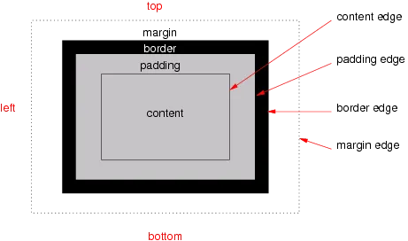

# Box Model

✅ 관련 노션 참조 : [슬비샘][Box-슬비샘], [WC3][Box-WC3]
✅ 관련 학습 파일 : src\css\05-box-model.html, src\css\styles\05-box-model.css

- CSS 박스 모델은 기본적으로 모든 HTML 요소를 포함하는 상자
  
- padding : `박스 안쪽`에 들어가는 여백(안쪽에 두툼하게 충전재가 들어간 패딩옷 생각하면 이해가 편함)
- margin : `박스 바깥쪽`에 생기는 여백
- border : 박스 외부테두리
- display : `property(속성)`의 개념
  - 즉, 화면에 표시되는 방법
  - inline, box, inline-box, flex, inline-flex, grid, inline-grid, table, table-row 등 정말 다양한 속성
  - 💡모든 HTML 요소는 각각 기본으로 지정된 display값이 존재

```html
body{ color: red; }
```

1. Display 속성

1. Inline

- ✅ width 속성으로 요소의 너비를 직접 지정할 수는 없음
- `inline`으로 지정된 요소는 자신의 전후로 줄바꿈을 만들지 않음
- 요소가 ㅁ, ㅁ, ㅁ, ㅁ 이런식으로 나열됨
  - 이 요소의 폭은 콘텐트 츠키에 따라 결정

2. Block

- 너비(width)와 높이(height)를 설정 가능
- 요소 박스 전후로 줄바꿈이 생김

3. Inline-Block

- `inline`과 같이 요소 전후로 줄바꿈이 생기지는 않지만, `block`요소처럼 width, height 속성으로 요소의 크기를 직접 지정 가능

---

- [Box-슬비샘]: https://www.w3.org/TR/css-box-3/
- [Box-WC3]: https://wholesale-snipe-50a.notion.site/Box-Model-114c3e449f1d80938b16e740e2ac00d2

# CSS중첩 (CSS nesting)

- CSS 중첩(Nesting)은 스타일시트의 가독성을 높이고 유지보수를 쉽게 해주는 기능으로, 선택자를 반복해서 작성할 필요 없이 부모-자식 관계를 명확하게 표현할 수 있다.

1. 기본적인 중첩방법

```
parent {
  /* 부모 스타일 */
  child {
    /* 부모의 자식 스타일 */
  }
}
```
